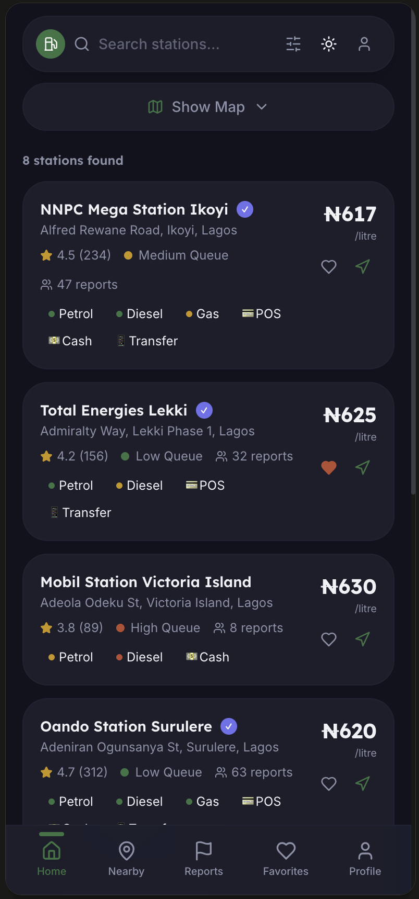
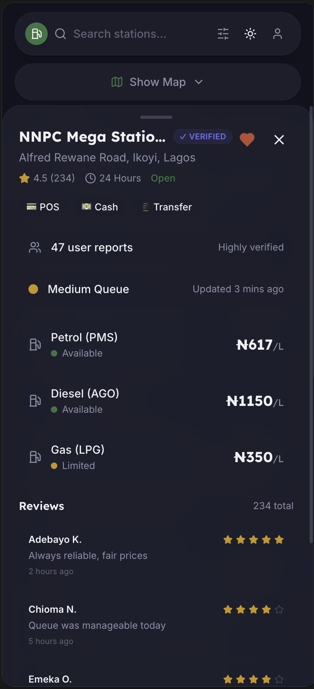
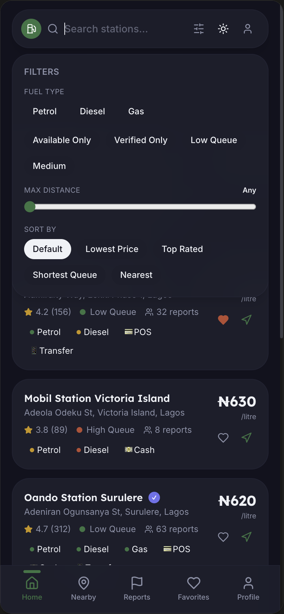
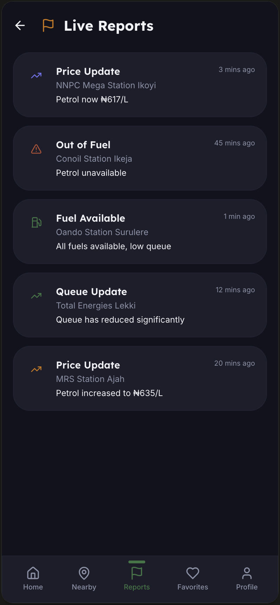

# Fuel Buddy NG

A location-aware fuel station discovery platform designed to help motorists find and compare nearby fuel stations based on price, availability, queue status, distance, ratings, and community reports.

## Overview

Fuel Buddy NG was created to solve a simple but common problem: arriving at a nearby fuel station only to discover that fuel is unavailable, the queue is too long, or another station would have been a better option.

The application helps users make better decisions before driving to a station by bringing useful station information into one place.

## Key Features

- 📍 Location-based discovery of nearby fuel stations
- ⛽ Fuel availability information
- 💰 Fuel price comparison
- 🚦 Queue status indicators
- ⭐ Station ratings and reviews
- 🔎 Search and filtering
- ❤️ Favorite stations
- 🗺️ Navigation and directions
- 📢 Community reports for prices, availability, and queue updates
- 👤 User accounts and profiles
- 🌓 Light and dark mode
- 🏪 Station owner dashboard concept

## How It Works

1. The application uses the user's location to identify nearby fuel stations.
2. Users can browse and compare stations based on distance, fuel type, price, availability, queue status, and ratings.
3. Users can view individual station details before deciding where to go.
4. Users can save preferred stations and access navigation directions.
5. Community reports can be used to provide updated information about prices, fuel availability, and queues.

## Technology Stack

- **Frontend:** React, TypeScript
- **Styling:** Tailwind CSS
- **Backend & Database:** Supabase, PostgreSQL
- **Authentication:** Supabase Auth
- **Maps & Location:** Geolocation and map-based services
- **Development:** Vite, Git, GitHub

## Data & Reliability

Fuel station information such as prices, availability, and queue conditions can change frequently.

Fuel Buddy NG is designed with community reporting in mind, allowing users to contribute updates that can help keep information useful for other motorists.

Because these conditions can change quickly, reported information should be treated as time-sensitive rather than guaranteed real-time data.

## Project Highlights

This project involved more than implementing a user interface. I defined the product concept, identified the problem it was intended to solve, planned the core functionality and user flows, and used AI-assisted development tools to implement and refine the application.

The project gave me practical experience working with:

- Location-aware application design
- Database-backed web applications
- User-generated data
- Search and filtering systems
- Authentication and user accounts
- Backend services and database integration
- Designing features around a real-world problem

## Future Improvements

- Improve the reliability and freshness of station data
- Add stronger verification for community reports
- Introduce timestamps and confidence indicators for reports
- Integrate additional official fuel-station data sources
- Expand station coverage
- Improve station-owner functionality
- Add notifications for important station updates

## Project Status

**MVP / Prototype**

The application demonstrates the core product concept and user experience. Some station information and reports may use simulated or prototype data rather than a live nationwide data source.

## Author

**Gabriel Ude**

Computer Science Student | Aspiring Full-Stack Developer

GitHub: [Gabriel071207](https://github.com/Gabriel071207)
## Screenshots

<table>
  <tr>
    <td align="center">
      <strong>Find nearby fuel stations</strong>  
      
    </td>
    <td align="center">
      <strong>View station details</strong>  
      
    </td>
  </tr>
  <tr>
    <td align="center">
      <strong>Search, filter and sort</strong>  
      
    </td>
    <td align="center">
      <strong>Community live reports</strong>  
      
    </td>
  </tr>
</table>
## Screenshots

